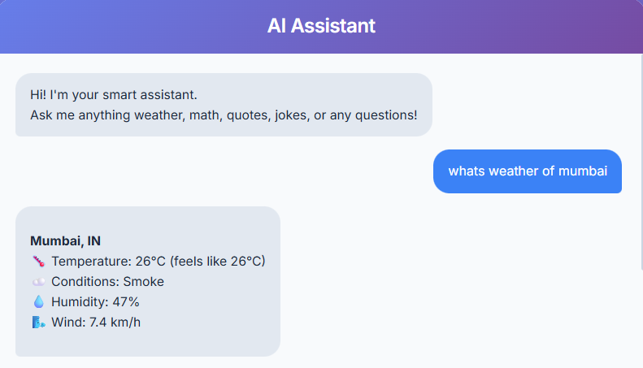
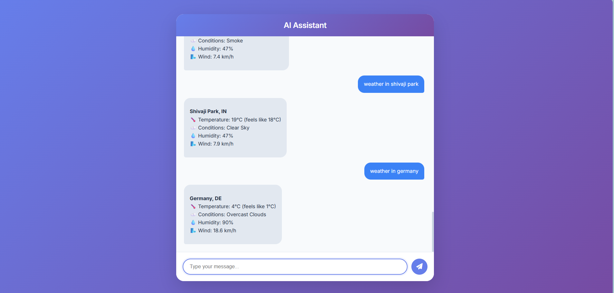

# 🤖 AI Assistant - Intelligent Conversational Agent

A Python-based AI assistant built with Flask that provides intelligent responses and performs multiple tasks through a modern, responsive web interface.



## 📋 Project Overview

This project implements a conversational AI agent that understands natural language queries and performs various tasks including weather information retrieval, mathematical calculations, joke generation, and general question answering using Google's Gemini AI.

## ✨ Features

### Core Functionalities

1. **🌤️ Weather Information**
   - Real-time weather data for any city worldwide
   - Temperature, humidity, wind speed, and weather conditions
   - Uses OpenWeatherMap API
   
   

2. **🧮 Mathematical Calculations**
   - Basic arithmetic operations (+, -, *, /)
   - Factorial calculations
   - Square root computation
   - Power/exponent operations
   - Natural language math queries (e.g., "calculate 5 + 3")
   
   

3. **😄 Jokes & Entertainment**
   - Random joke generation
   - On-demand humor responses
   
   

4. **🕐 Date & Time**
   - Current date and time information

### Bonus Features

5. **🧠 AI-Powered Responses**
   - Integration with Google Gemini AI (gemini-flash-lite-latest)
   - Context-aware conversations
   - General knowledge question answering
   - Quote generation from famous personalities

6. **💬 Conversational Context**
   - Session-based conversation history
   - Maintains context across multiple exchanges
   - Natural, flowing dialogue

## 🎨 Screenshots

<div align="center">

### Weather Query


### Mathematical Operations


### Jokes & Quotes


### Multi-City Weather


</div>

## 🛠️ Technology Stack

- **Backend**: Python 3.x, Flask
- **Frontend**: HTML5, CSS3, JavaScript
- **AI/ML**: Google Generative AI (Gemini)
- **APIs**: 
  - OpenWeatherMap API
  - Google Gemini API
- **Libraries**:
  - Marked.js (Markdown rendering)
  - Highlight.js (Code syntax highlighting)
  - Font Awesome (Icons)

## 📁 Project Structure

```
shvx_task/
│
├── app.py                    # Main Flask application
├── templates/
│   └── index.html           # Frontend UI
├── static/
│   ├── weather.png          # Screenshot: Weather feature
│   ├── weather2.png         # Screenshot: Multi-city weather
│   ├── maths.png            # Screenshot: Math calculations
│   └── jokes_quotes.png     # Screenshot: Jokes & quotes
├── .env                     # Environment variables (API keys)
├── requirements.txt         # Python dependencies
└── README.md               # Project documentation
```

## 🚀 Installation & Setup

### Prerequisites

- Python 3.7 or higher
- pip (Python package manager)
- API Keys:
  - OpenWeatherMap API key ([Get it here](https://openweathermap.org/api))
  - Google Gemini API key ([Get it here](https://makersuite.google.com/app/apikey))

### 📦 Dependencies

```txt
Flask==3.0.0
python-dotenv==1.0.0
requests==2.31.0
google-generativeai==0.3.1
```

### Installation Steps

1. **Clone the repository**
   ```bash
   git clone <repository-url>
   cd shvx_task
   ```

2. **Install dependencies**
   ```bash
   pip install -r requirements.txt
   ```

3. **Configure environment variables**
   
   Create a `.env` file in the project root:
   ```env
   OPENWEATHER_API_KEY=your_openweather_api_key_here
   GEMINI_API_KEY=your_gemini_api_key_here
   FLASK_SECRET_KEY=your_secret_key_here
   ```

4. **Run the application**
   ```bash
   python app.py
   ```

5. **Access the application**
   
   Open your browser and navigate to: `http://127.0.0.1:5000`

## 💻 Usage Examples

### Weather Queries
```
"What's the weather in Mumbai?"
"Weather of London"
"Temperature in Paris"
"Weather in Shivaji Park"
"Weather in Germany"
```

### Math Operations
```
"Calculate 43 + 23"
"323/23*323"
"Factorial of 9"
"Square root of 144"
"2 to the power of 10"
```

### General Queries
```
"Tell me a joke"
"Make me laugh"
"What's the time?"
"Quote by Swami Vivekananda"
"Famous quotes by famous personality"
"That is a good one"
"Explain quantum computing"
```

## 🎯 Key Implementation Details

### Natural Language Processing
- Keyword-based detection for specialized tasks
- Pattern matching with regex for city extraction and math operations
- Fallback to AI for complex queries

### Modular Architecture
- Separate functions for each feature (weather, math, jokes)
- Easy to extend with new capabilities
- Clean separation of concerns

### Error Handling
- Graceful degradation when APIs are unavailable
- User-friendly error messages
- Timeout handling for external API calls

### UI/UX Features
- Modern, gradient-based design (Purple theme)
- Markdown support in responses
- Code syntax highlighting
- Responsive layout (mobile-friendly)
- Smooth animations and transitions
- Real-time typing indicators
- Distinct message bubbles for user and assistant

## 🔒 Security Considerations

- Environment variables for sensitive API keys
- Input sanitization for math expressions
- Limited eval scope for calculations
- Session management with secret keys

## 🧪 Testing Coverage

The application has been thoroughly tested with various edge cases:

✅ Simple weather queries  
✅ Complex city names (e.g., "Shivaji Park")  
✅ Country-based weather (e.g., "Germany")  
✅ Multi-word city names  
✅ Natural language math ("can you add 43+23")  
✅ Complex mathematical expressions  
✅ Factorial calculations  
✅ Square roots and powers  
✅ Contextual conversations  
✅ Quote requests with specific personalities  

